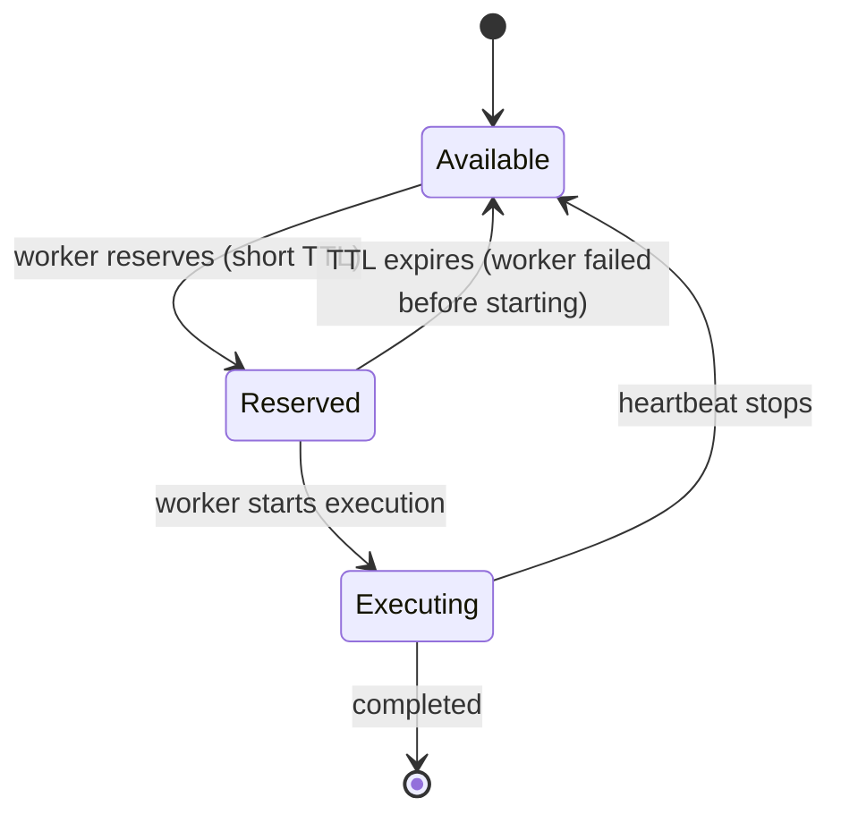

# Roadmap

This document outlines the planned development for Sayiir.

---

## In Progress

### PostgreSQL Backend

Production-ready persistence with PostgreSQL.

- Schema design for workflows, snapshots, and claims
- Connection pooling and retry logic
- Migration tooling

### Cloudflare Workers Support

Run Sayiir on the edge via Durable Objects.

- Durable Object persistence backend
- Stateless worker execution model
- Cold start optimization

---

## Planned

### Language Bindings

#### Python

- PyO3-based bindings
- Native async/await support
- Pydantic integration for task inputs/outputs

#### Node.js / TypeScript

- NAPI-RS bindings
- Promise-based API
- TypeScript type definitions

### Runtime Improvements

#### Two-Phase Claiming

Distinguish between "reserved" and "executing" states for faster failure detection.



**Proposed API:**

```rust
pub enum TaskClaimState {
    Reserved { expires_at: Timestamp },
    Executing {
        worker_id: String,
        started_at: Timestamp,
        last_heartbeat: Timestamp,
    },
}
```

**Benefits:**

- Fast detection of workers that crash before starting
- Flexible TTL based on task state
- Clear visibility into task status

#### Task Priority Queues

Execute high-priority tasks before lower-priority ones.

#### Worker Affinity / Task Routing

Route specific task types to specific worker pools.

#### Workflow Cancellation and Pausing

Gracefully stop or pause running workflows.

#### Dead Letter Queue

Capture and inspect permanently failed tasks.

### Observability

#### Metrics

- Prometheus/OpenMetrics export
- Task latency histograms
- Queue depth gauges
- Worker utilization

#### Tracing

- OpenTelemetry integration
- Distributed trace context propagation
- Span-per-task granularity

---

## Design Patterns

### Idempotent Tasks

> **Note:** This is a client-side design pattern, not a runtime feature.

Instead of relying solely on claim coordination, users can design tasks to be safely re-executable. If a task runs twice with the same input, it produces the same result.

Recommended for tasks that are naturally idempotent or can be made so with minimal effort. This eliminates edge cases around duplicate execution.

---

## Enterprise Features (Planned)

These features will be available in the commercial offering:

### Managed Control Plane

- Horizontally scalable gRPC server
- Kubernetes-native deployment (Helm charts, operators)
- Multi-region support

### Web UI

- Workflow visualization (DAG view)
- Real-time execution monitoring
- Manual retry/skip/cancel operations
- Search and filtering

### Audit and Compliance

- Complete execution history
- Immutable audit log
- Data retention policies
- Export capabilities

### Time-Critical Tasks

For workflows where timing matters:

- Per-task and per-workflow deadline configuration
- SLA-based execution guarantees
- Automatic escalation on deadline breach (webhooks, alerts)
- Deadline-aware scheduling and priority boosting
- Latency-sensitive task routing to fastest workers

### Multi-Tenancy

- Isolated worker pools per tenant
- Resource quotas and limits
- Tenant-specific configuration

### Security

- mTLS between all components
- Role-based access control (RBAC)
- Secrets management integration (Vault, AWS Secrets Manager)
- Encryption at rest

### Auto-Scaling

- Queue-depth-based worker scaling
- Kubernetes HPA and Keda integration
- Predictive scaling based on historical patterns

---

## Contributing

Want to help? Check out the issues labeled `good first issue` or join our [Discord](https://discord.gg/MWSzsHeg) to discuss.

Areas where contributions are especially welcome:

- Storage backend implementations
- Documentation and examples
- Testing and benchmarking
- Language binding prototypes
