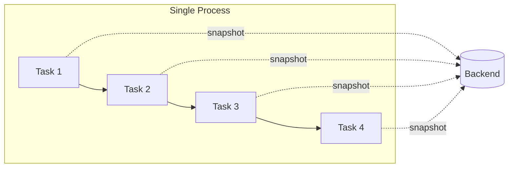
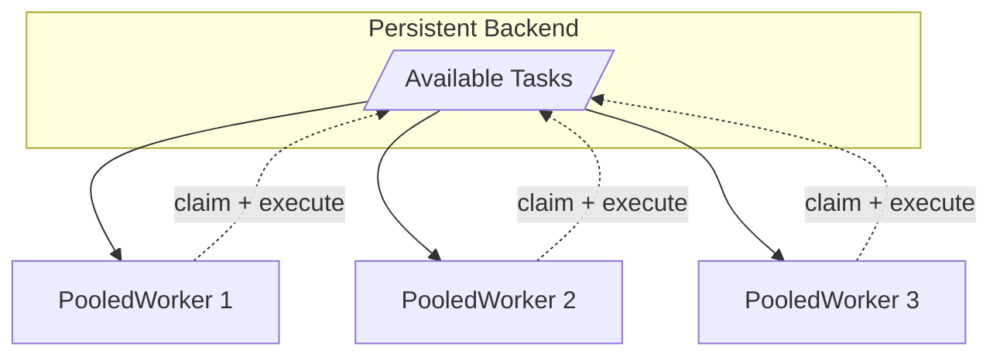
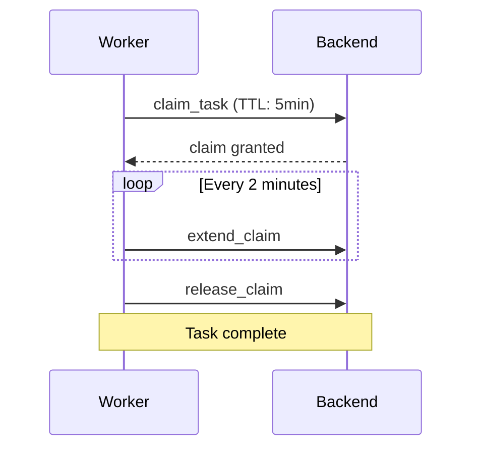
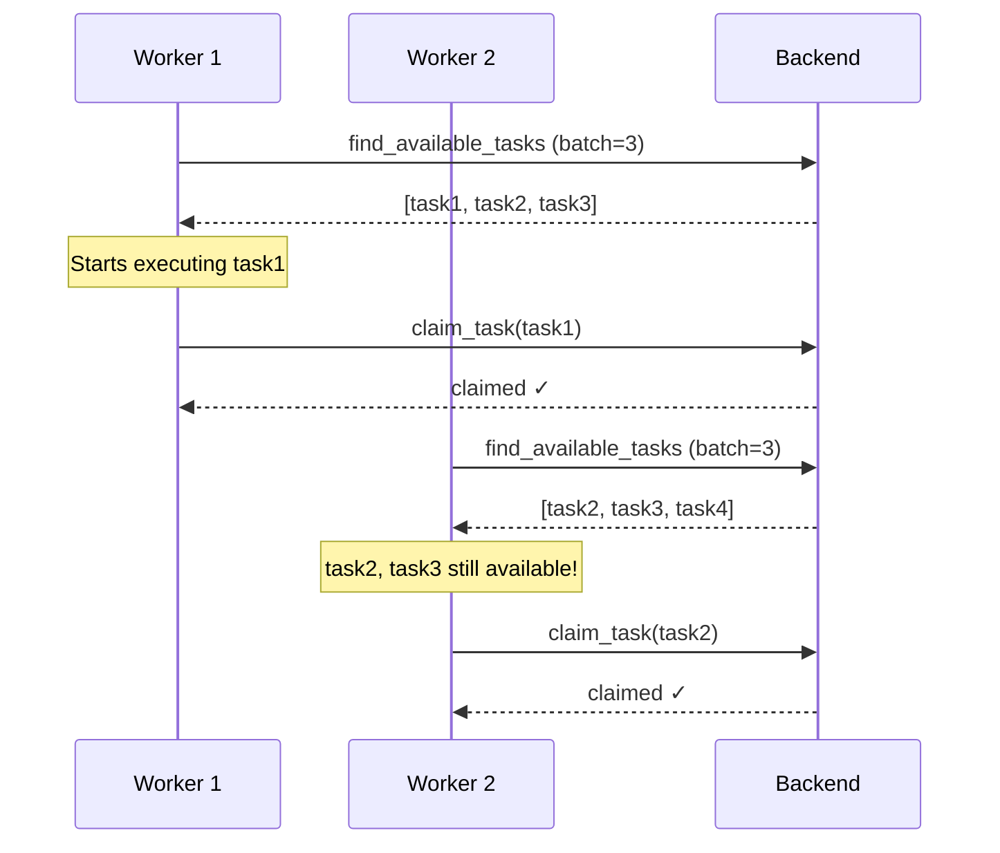

# workflow-runtime

Runtime execution strategies for durable workflows.

## Execution Strategies

| Strategy | Use Case |
|----------|----------|
| [`CheckpointingRunner`](#checkpointingrunner) | Single-process with crash recovery |
| [`PooledWorker`](#pooledworker) | Multi-worker horizontal scaling |
| `InProcessRunner` | Simple in-memory execution (no persistence) |

---

### CheckpointingRunner

Executes an entire workflow within a single process, saving snapshots after each task. Fork branches run concurrently as tokio tasks.



**When to use:**
- Single-node deployment
- Crash recovery needed (resume from last checkpoint)
- Simple deployment without coordination

**Example:**

```rust
use workflow_runtime::CheckpointingRunner;
use workflow_persistence::InMemoryBackend;

let backend = InMemoryBackend::new();
let runner = CheckpointingRunner::new(backend);

// Run workflow with automatic checkpointing
let status = runner.run(&workflow, "instance-123", input).await?;

// Resume after crash
let status = runner.resume(&workflow, "instance-123").await?;
```

---

### PooledWorker

Multiple workers poll a shared backend, claim tasks, and execute them concurrently. Task claiming with TTL prevents duplicate execution.



**When to use:**
- Horizontal scaling across multiple machines
- High throughput requirements
- Fault tolerance (crashed workers' tasks auto-reclaim)

**Example:**

```rust
use workflow_runtime::PooledWorker;
use workflow_persistence::PostgresBackend;
use std::time::Duration;

let backend = PostgresBackend::new(pool);
let registry = TaskRegistry::new();

let worker = PooledWorker::new("worker-1", backend, registry)
    .with_claim_ttl(Some(Duration::from_secs(5 * 60)))
    .with_heartbeat_interval(Some(Duration::from_secs(2 * 60)));

// Start polling for tasks
worker.start_polling(Duration::from_secs(1), workflows).await?;
```

---

## Comparison

| Aspect | CheckpointingRunner | PooledWorker |
|--------|---------------------|--------------|
| Execution | Single process | Multiple workers |
| Concurrency | Forks run as tokio tasks | Claim-based distribution |
| Scaling | Vertical | Horizontal |
| Coordination | None needed | Via backend claims |
| Failure recovery | Resume from snapshot | Claim expires, task retried |

---

## Task Claiming (PooledWorker)

Workers use a heartbeat mechanism to hold task claims:



**Configuration:**

| Setting | Default | Description |
|---------|---------|-------------|
| `claim_ttl` | 5 minutes | How long a claim is valid |
| `heartbeat_interval` | 2 minutes | How often to extend the claim |
| `batch_size` | 1 | Tasks to fetch per poll |

If a worker crashes, its heartbeat stops and the claim expires, allowing another worker to pick up the task.

---

## Polling vs Claiming

**Important distinction:** Fetching tasks and claiming tasks are separate operations.



- **Fetching** returns task IDs that are currently unclaimed
- **Claiming** happens when execution starts (one task at a time)
- Other workers can "steal" fetched-but-not-yet-claimed tasks
- `batch_size` controls fetch count, not claim count

With `batch_size=1` (default), each worker fetches one task, executes it, then polls again. This minimizes stale task IDs while keeping polling overhead low.

---

## See Also

- [ROADMAP.md](./ROADMAP.md) - Alternative claiming strategies and future improvements
