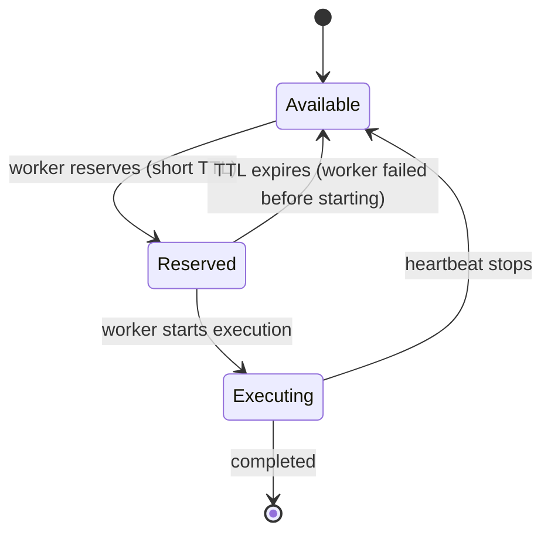

# Roadmap

Future improvements for the workflow runtime.

## Alternative: Idempotent Tasks

> **Note:** This is a client-side design pattern, not a runtime feature.

Instead of relying on claim coordination, users can design tasks to be safely re-executable. If a task runs twice with the same input, it produces the same result. This eliminates the need for complex claiming strategies.

Recommended for tasks that are naturally idempotent or can be made so with minimal effort.

---

## Two-Phase Claiming

Distinguish between "reserved" and "executing" states for faster failure detection.



**Proposed API:**

```rust
pub enum TaskClaimState {
    Reserved { expires_at: Timestamp },
    Executing {
        worker_id: String,
        started_at: Timestamp,
        last_heartbeat: Timestamp,
    },
}
```

**Benefits:**

- Fast detection of workers that crash before starting
- Flexible TTL based on task state
- Clear visibility into task status

---

## Future Work

- [ ] Two-phase claiming implementation
- [ ] Task priority queues
- [ ] Worker affinity / task routing
- [ ] Metrics and observability
- [ ] Dead letter queue for failed tasks
- [ ] Workflow cancellation, pausing
